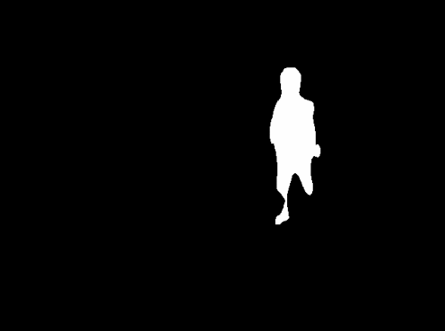

# Detectron binary mask detection
### This project allows you to generate person binary mask using [detectron2](https://github.com/facebookresearch/detectron2)v0.4
### It is recommended to create a bigger people annotated dataset to get better results

##### example of using detection rgb falling person image
### Technologies:
* Python 3.8+
* Detectron2 v0.4 [detectron_releases](https://github.com/facebookresearch/detectron2/releases)
* Windows or Linux (in Linux you have to change paths "\\" to "/" in check.py file) 
### Instalation and getting started (Windows):
1. Install torch depending on your version of cuda [https://pytorch.org/get-started/locally/](https://pytorch.org/get-started/locally/)
2. Install opencv
```
pip install opencv-python
```
4. Install cython
```
pip install cython
```
5. Install pycolotools using this tutorial [https://github.com/philferriere/cocoapi](https://github.com/philferriere/cocoapi)
6. Edit following file detectron2\detectron2\layers\csrc\nms_rotated\nms_rotated_cuda.cu with [https://chowdera.com/2022/03/202203021227485707.html](https://chowdera.com/2022/03/202203021227485707.html) this tutorial to fix nvcc/exe error
8. Replace visualizer.py in detectron2\detectron2\utils provided in project
9. Place people_dataset or your own dataset in detectron2\detectron\datasets
10. Move train.py and check.py to main location 
11. Run dataset training
``` 
pip train.py
```
12. Run detection and mask generation
```
pip check.py <image_name_folder>
```

