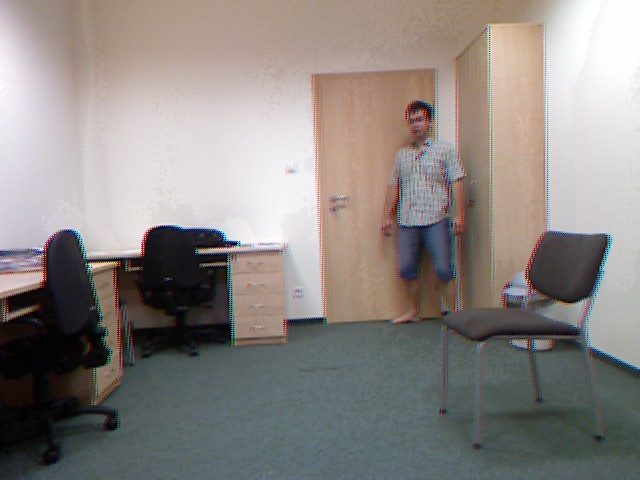
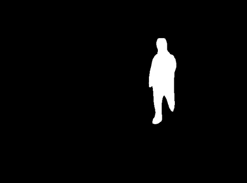
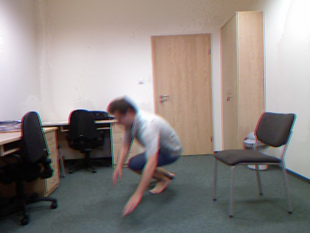
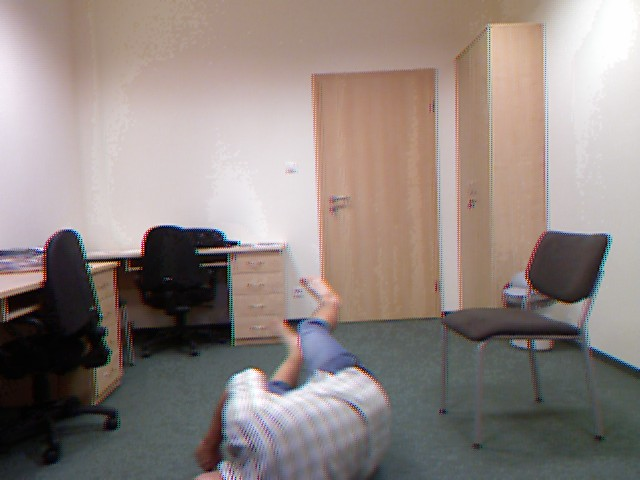

# detectron2_temp

Z 160 zdjec znaleziono maske do 123 zdjęć, 37 sie nie udalo.
Skuteczność około 76%. (Spowodowane jest to niewielką ilością zdjęć do uczenia oraz jakością zdjęć do przetwarzania)

pip list -v | grep detectron2

cd ~/python3.x/site-packages/detectron2/utils/visualizer.py
